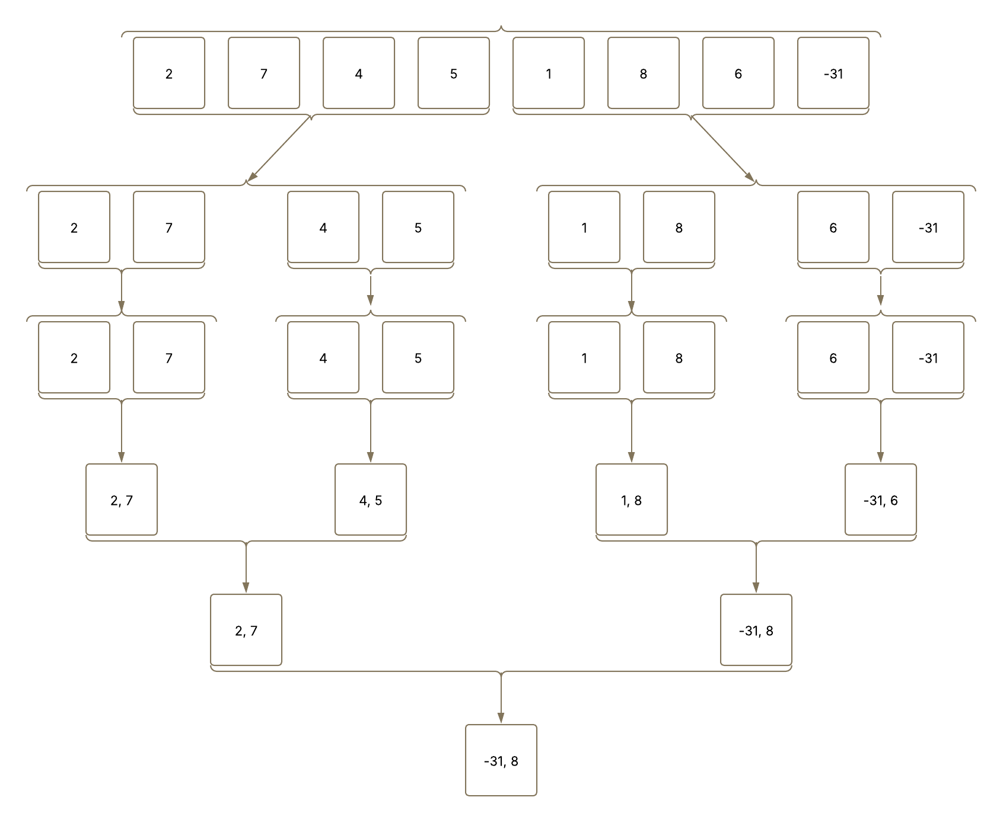

# Algoritmo MaxMin Select (Máximo e Mínimo por Divisão e Conquista)

Este projeto implementa um algoritmo para encontrar o menor e o maior elemento em um array usando a técnica de divisão e conquista, reduzindo o número de comparações em relação à busca simples.

---

## Descrição do Projeto

O algoritmo max\_min\_select encontra o mínimo e máximo de um array de inteiros usando recursão. A lógica é dividir o array em subproblemas menores até chegar em casos triviais, e depois combinar os resultados dos subproblemas para obter o resultado final.

Linha a linha:

```python
def max_min_select(array: List[int]) -> Tuple[int, int]:
    # Chama a função recursiva principal
    return _max_min_select(array, 0, len(array) - 1)

def _max_min_select(array: List[int], esq: int, dir: int) -> Tuple[int, int]:
    # Confere se o array está vazio
    if len(array) == 0:
        raise ValueError("O array está vazio.")

    # Caso o array tenha tamanha 1, retorna esse elemento como min e max
    if esq == dir:
        return (array[esq], array[dir])
  
    # Caso o array tenha tamanho 2, compara os dois elementos e retorna min e max
    if dir == esq + 1:
        # Caso o da direita seja maior que o da esquerda, min = esquerda, max = direita
        if array[esq] < array[dir]:
            return (array[esq], array[dir])
        # Caso o da esquerda seja maior que o da direita, min = direita, max = esquerda
        else:
            return (array[dir], array[esq])
  
    # Divide o array ao meio
    meio = (esq + dir) // 2

    # Chama o código recursivo para encontrar min e max na metade esquerda
    esq_min, esq_max = _max_min_select(array, esq, meio)
    # Chama o código recursivo para encontrar min e max na metade direita
    dir_min, dir_max = _max_min_select(array, meio + 1, dir)
  
    # Coleta o min geral entre o min da esquerda e da direita
    min_geral = min(esq_min, dir_min)
    # Coleta o max geral entre o max da esquerda e da direita
    max_geral = max(esq_max, dir_max)
  
    # Retorna o mínimo e o máximo do intervalo atual
    return (min_geral, max_geral)
```

### main de execução:

```python
def main():
    array = [9, 2, 7, 4, 5, 1, 8, 6, 31]

    min, max = max_min_select(array) # Coleta o menor e o maior valor do array
    print(f"Array: {array}") # Array original
    print(f"Menor valor: {min}") # Menor valor do array
    print(f"Maior valor: {max}") # Maior valor do array

if __name__ == "__main__":
    main()
```

---

## Dividir para conquistar



---

## Como executar o projeto

1. Clone este repositório:

   ```bash
   git clone https://github.com/iannovais/fpaa-max-min-select.git
   cd fpaa-max-min-select
   ```
2. Execute o código em Python 3:

   ```bash
   python main.py
   ```
3. O programa exibirá:

   * O array original.
   * O menor e maior valor do array fornecido.

---

## Relatório Técnico

### Análise da Complexidade Assintótica pelo Método de Contagem de Operações

**Número de comparações por etapa:**

* Para n = 1: T(1) = 0
* Para n = 2: T(2) = 1
* Para n > 2: T(n) = 2 * T(n/2) + 2

Ou seja, o número de comparações cresce linearmente, o que implica na complexidade **O(n)**.

---

### Análise pela aplicação do Teorema Mestre

A recorrência dada para o algoritmo é:

$$
T(n) = 2T\left(\frac{n}{2}\right) + O(1)
$$

* a = 2
* b = 2
* f(n) = O(1)

Calculando $p = \log_b a = \log_2 2 = 1$.

Aplicando os casos do Teorema Mestre:

* Caso 1: Se $f(n) = O(n^c)$ com $c < p$, então $T(n) = \Theta(n^p)$
* Caso 2: Se $f(n) = \Theta(n^p \log^k n)$, então $T(n) = \Theta(n^p \log^{k+1} n)$
* Caso 3: Se $f(n) = \Omega(n^c)$ com $c > p$, então $T(n) = \Theta(f(n))$

Então, $f(n) = O(1) = O(n^0)$, com $0 < 1 = p$, entramos no **Caso 1**.

$$
T(n) = \Theta(n^1) = \Theta(n)
$$

* Melhor caso: O(n)
* Pior caso: O(n)
* Caso médio: O(n)

---

## Referência

* [Algoritmos de Divisão e Conquista – GeeksforGeeks](https://www.geeksforgeeks.org/maximum-and-minimum-in-an-array/)
